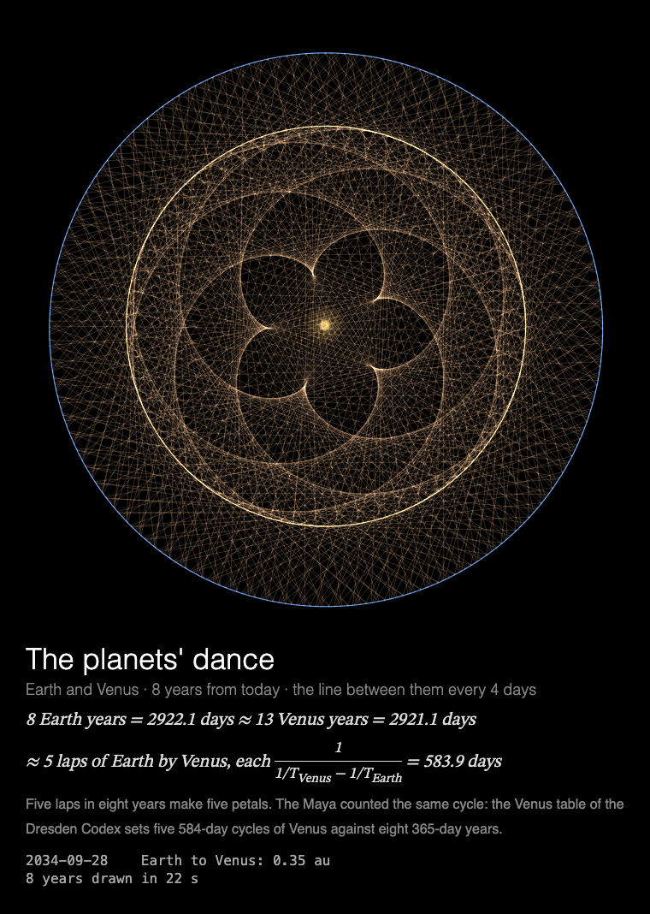

# MMM-PlanetsDance

A [MagicMirror²](https://magicmirror.builders/) module that draws the planets' real orbits, from today, as figures that look like sacred geometry.



**The planets' dance.** Real orbits from today, drawn as figures that look like sacred geometry
and are nothing but clockwork: the line between Earth and Venus every 4 days for 8 years makes
a five-petalled rose; Mars, Jupiter or Saturn seen from Earth loop back each time we overtake
them; every meeting of Jupiter and Saturn for 800 years, joined in order, is Kepler's turning
triangle. One of eight figures each time the module is shown, drawn in 22 s, then held.
Underneath: the figure's arithmetic, a note from its history (the Maya's Venus table, Ptolemy's
epicycles, Galileo's moons of Jupiter), and the date the drawing has reached, with the distance
between the planets or, for a loop, whether the planet is going backwards.

Built for a **Raspberry Pi 3 without GPU acceleration**: everything is drawn by the CPU, so the
drawing is designed around what that costs (see [Performance](#performance)), and the animation
stops completely while the module is hidden.

## Installation

```bash
cd ~/MagicMirror/modules
git clone https://github.com/charleswest775/MMM-PlanetsDance
```

No npm dependencies: there is nothing to install.

## Update

```bash
cd ~/MagicMirror/modules/MMM-PlanetsDance
git pull
```

## Configuration

```js
{
	module: "MMM-PlanetsDance",
	position: "middle_center",
	config: {
		orbitsSeconds: 22,  // drawn in 22 s of a 30 s page, then held
		orbitsDances: [],   // all eight, one per showing
		width: 700,
		height: 700,
		fps: 12
	}
},
```

| Option | Default | Description |
|---|---|---|
| `orbitsSeconds` | `22` | Seconds to draw a figure; then it holds |
| `orbitsDances` | `[]` | Which figures, e.g. `["venus", "trigon"]`. Empty = all eight: `venus`, `venus-loops`, `mercury`, `mars`, `jupiter-saturn`, `trigon`, `jupiter`, `saturn`, one per showing, all before any repeats |
| `cycleSeconds` | `600` | A new figure each time the module is shown, or this often while it stays shown |
| `width`, `height` | `700` | Canvas size in pixels |
| `fps` | `12` | Frame-rate cap |
| `showMath` | `true` | Title, equations, note and live numbers under the canvas |
| `turns` | `null` | Take turns with other modules on the same page, e.g. `{ of: 3, at: 2 }`: see [Taking turns](#taking-turns) |
| `statsPanel` | `false` | A line under the caption showing what the mirror spends: fps, CPU of Electron and the compositor, a bar per core, temperature. Sampled by the module's `node_helper` from `/proc`, only while the module is shown |
| `debugStats` | `false` | Show achieved fps and per-frame timings in the corner of the screen |

## Taking turns

With [MMM-pages](https://github.com/edward-shen/MMM-pages), every page added makes the rotation
longer. Modules on the same page can share it instead: with `turns: { of: n, at: k }`, each of
n modules shows on its own one in n showings of the page, the first on showing 0, the next on
showing 1, and so on. A module not on its turn takes no room on the page and costs nothing.

On the mirror this module takes turns with two others that draw a figure and hold it,
[MMM-SacredGeometry](https://github.com/charleswest775/MMM-SacredGeometry) and
[MMM-Tilings](https://github.com/charleswest775/MMM-Tilings):

```js
{
	module: "MMM-SacredGeometry",
	classes: "page-sacred",
	position: "middle_center",
	config: { turns: { of: 3, at: 0 } }
},
{
	module: "MMM-Tilings",
	classes: "page-sacred",
	position: "middle_center",
	config: { turns: { of: 3, at: 1 } }
},
{
	module: "MMM-PlanetsDance",
	classes: "page-sacred",
	position: "middle_center",
	config: { turns: { of: 3, at: 2 } }
},
```

with the page in MMM-pages' list, e.g. `modules: [["page-sacred"], ["page-sky"]]`.

The module works just as well on a page of its own (leave `turns` out), or in a normal region
without MMM-pages, where it is never hidden and draws a new figure every `cycleSeconds`.

## The eight figures

Each showing draws one of eight figures from today's date, with time running evenly, so a
planet lingers where it really moves slowly:

- **Earth and Venus**, the line between them every 4 days for 8 years: a five-petalled rose,
  because 8 Earth years (2922.1 days) ≈ 13 Venus years (2921.1) ≈ 5 laps of Earth by Venus
  (5 × 583.9). **Earth and Mercury**, every 3 days for 7 years: 22 laps, 29 Mercury years.
  **Jupiter and Saturn**, every month for three of Jupiter's laps of Saturn (60 years).
- **Venus, Mars, Jupiter or Saturn seen from Earth**: the planet's position minus Earth's,
  with Earth at the centre and the Sun's yearly circle round it. It loops back each time one
  overtakes the other: Venus 5 times in 8 years, at the corners of a pentagram; Mars 7 times
  in 15; Jupiter 11 times, Saturn 28, in one of their years. Ptolemy's epicycles were built to
  reproduce exactly these loops.
- **Kepler's trigon**: every conjunction of Jupiter and Saturn from the one of 2020 on for 800
  years, joined in order on the circle of the zodiac. Each is 243° on from the last, so three
  make a triangle that turns 9° every 60 years, and after 40 the meetings are back in the same
  signs. Longitudes are measured from the equinox of each date, which precesses 1.4° a century,
  as Kepler's were.

The figures are dealt from a shuffled deck, so all eight come round before any repeats.

## Where the planets are

Positions come from JPL's *Keplerian Elements for Approximate Positions of the Major Planets*
(Standish), in `simulations/ephemeris.js`: each orbit an ellipse whose elements drift linearly,
fitted to JPL's DE ephemeris, good to arcseconds for the inner planets and arcminutes for Saturn
from 1800 to 2050 (Table 1), and coarser from 3000 BC to AD 3000 (Table 2, used outside those
years). The tests check them against the almanacs: Venus's inferior conjunctions of 2020–2026
and Mars's oppositions of 2018–2027 to the day, Jupiter and Saturn 0.10° apart on 21 December
2020, and the conjunction of December 1603 that Kepler watched. They also check JPL's two tables
against each other, Kepler's third law, Venus's 8-year cycle and the 2.4° its pentagram turns in
it, Mars going backwards at opposition, and the trigon's 243° steps.

## Performance

Drawn like sacred geometry: each frame adds only what is new, with `lighter` compositing so
crossings brighten, and the finished figure rests. Measured in a desktop browser by diffing
frames, a frame changes on average 15% of the canvas for the line figures and under 1% for the
loops.

Measured on a Raspberry Pi 3 B+ (Electron 42, software rendering, 700×700 at 12 fps, seven
showings, CPU of the Electron processes plus the `cage` compositor, in % of one core; the Pi has
four, and the mirror without the module uses 0.2%):

| | % of one core | achieved fps |
|---|---|---|
| while a figure is drawn | ~30 | 12 |
| the finished figure held (stats panel on) | ~4 | 0 |
| over a 30 s showing, its page change included (drawn by ~25 s) | 33 (23–39) | 12 |

What costs what on the Pi:

- There is no GPU acceleration to be had (the Pi 3's GPU does only GLES 2.0), so all canvas
  drawing is done by the CPU.
- Any frame that changes the canvas costs ~2% of a core per fps, before drawing anything; hence
  the 12 fps cap.
- On top of that, cost grows with the **area that changes**: Chromium redraws the bounding box
  of everything touched in a frame. So each frame draws only the strokes added since the last.
- JavaScript is not the bottleneck: the figure is computed once per showing, and step and draw
  take a few milliseconds per frame.
- The frame loop sleeps with `setTimeout` until a frame is due. Once the figure is finished the
  module rests, and is only polled twice a second. While MagicMirror fades the module out,
  nothing new is drawn, and once it is hidden (another MMM-pages page, say) the loop stops
  completely: measured with the same loop in MMM-ChaosTheory, 0.3% of a core against the
  mirror's 0.2% without it.

## Development

```bash
node --test                  # the ephemeris against the almanacs, and every figure (no dependencies)
python3 -m http.server       # in the module folder, then open http://localhost:8000/dev/preview.html
```

`dev/preview.html` runs the module outside MagicMirror², in a portrait 1200×1920 frame, with
hide/show buttons that follow MagicMirror's suspend/resume order. Query options override the
config, e.g. `?dance=venus` (always this figure), `?dance=trigon&start=1600-01-01` (from another
date), `?orbitsDances=mars,jupiter`, `?orbitsSeconds=8&fps=20` or `?statsPanel=true` (with
made-up numbers, as there is no `node_helper` in the preview).

## License

MIT. Planetary positions from JPL's *Keplerian Elements for Approximate Positions of the Major
Planets* by E. M. Standish (JPL/Caltech).

Part of a family: [MMM-ChaosTheory](https://github.com/charleswest775/MMM-ChaosTheory),
[MMM-Atom](https://github.com/charleswest775/MMM-Atom),
[MMM-FractalZoom](https://github.com/charleswest775/MMM-FractalZoom),
[MMM-Chladni](https://github.com/charleswest775/MMM-Chladni),
[MMM-SacredGeometry](https://github.com/charleswest775/MMM-SacredGeometry),
[MMM-Tilings](https://github.com/charleswest775/MMM-Tilings),
[MMM-SnowCrystal](https://github.com/charleswest775/MMM-SnowCrystal),
[MMM-NightSky](https://github.com/charleswest775/MMM-NightSky) and
[MMM-PhotoDeck](https://github.com/charleswest775/MMM-PhotoDeck).
